## JDK 설치

- JDK(Java Development Kit) - 자바 프로그램 개발 및 실행을 위한 Java SE(Standard Edition) 구현체
  - Open JDK
    - 버전 - JDK 8, JDK 11, JDK 17
  - Oracle JDK

### 다운로드

[https://adoptium.net](https://adoptium.net/)

- 윈도우 사용자 - Download Temurin for Windows x64 다운

  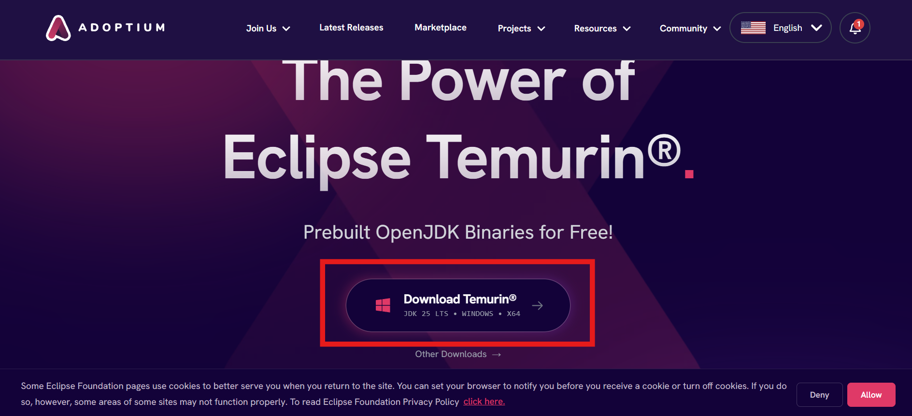
  - 강의 버전에 맞춰서 다운 받음

    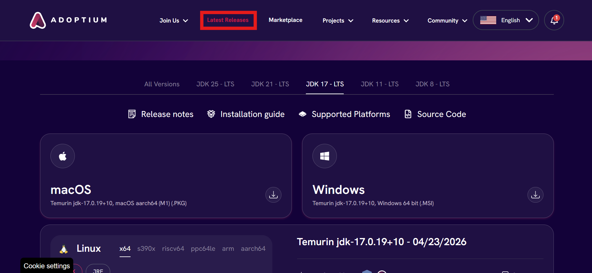

  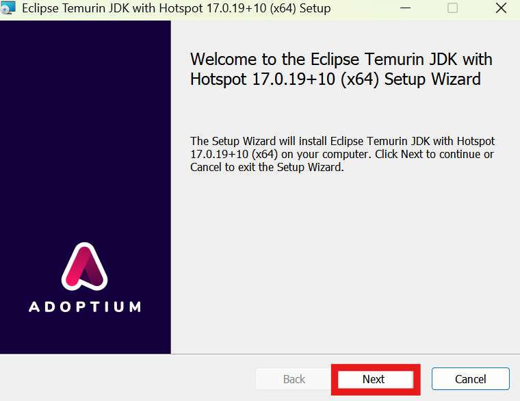

  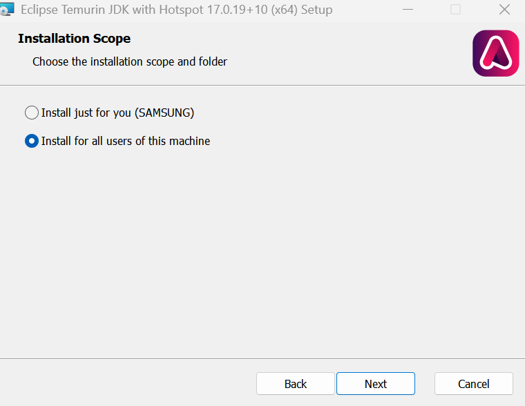

  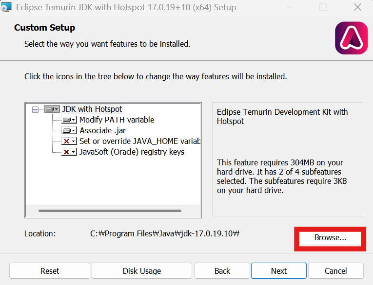

  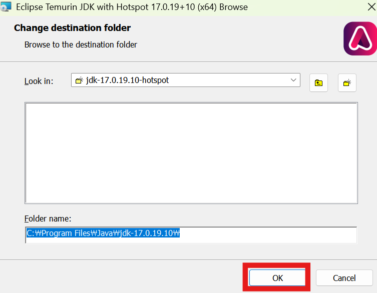

  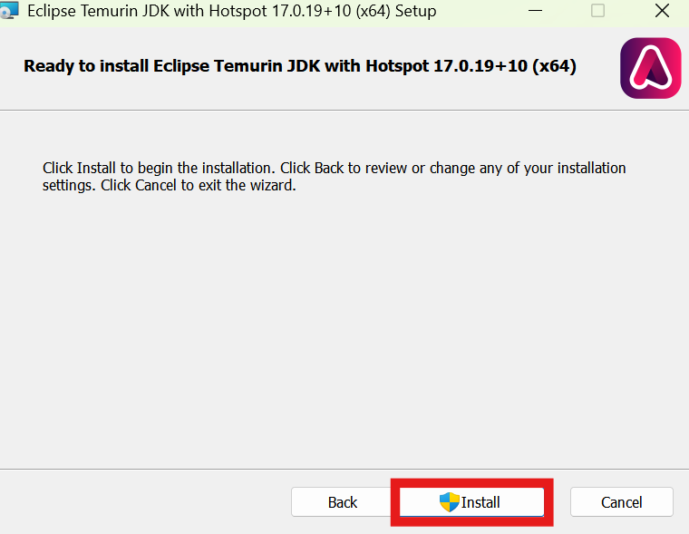

## 윈도우 환경 변수 설정

- 운영체제는 프로그램이 실행하면서 사용할 수 있는 값을 환경 변수 이름으로 관리
- JDK 설치 후 프로그램들이 JDK를 이용할 수 있도록 JAVA_HOME 환경 변수 생성, Path 환경 변수를 수정하는 것이 좋음

### 환경 변수 설정

- 시스템 환경 변수 편집 검색 후 실행

  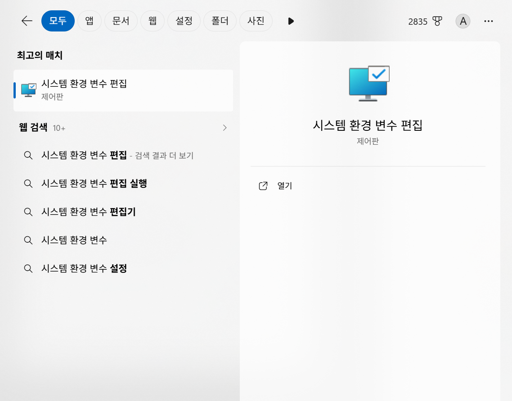

  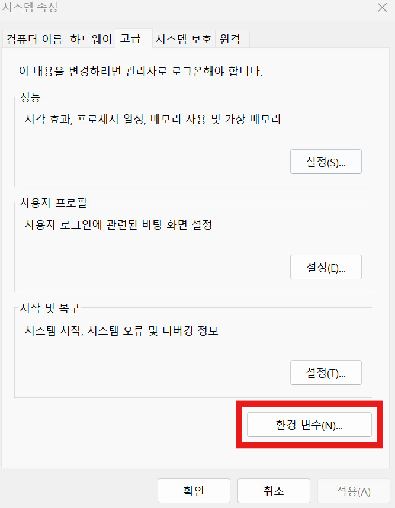

  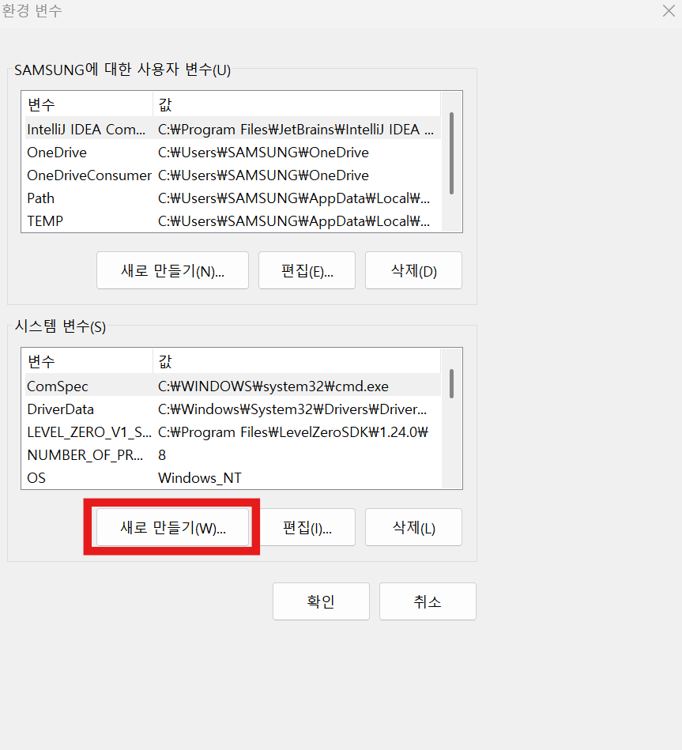

- `디렉터리 찾아보기`에서 설치 경로 입력

  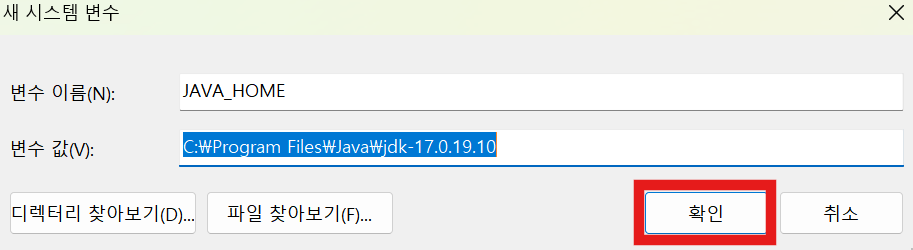

- bin 디렉터리

  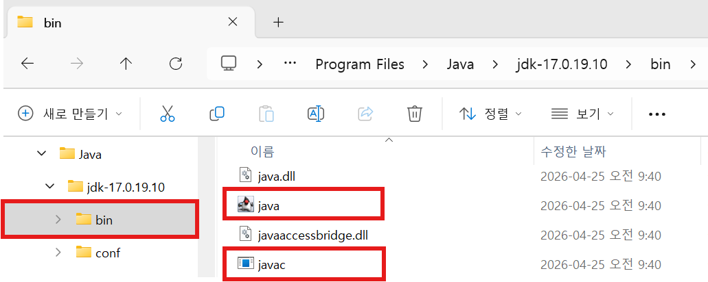
  - javac.exe - 자바 소스 파일 컴파일
  - java.exe - 자바 프로그램 실행 명령어

#### Path 환경 변수 설정

- javac, java 명령어는 명령 프롬포트 또는 파워쉘에서 컴파일, 실행 시 사용
- bin 디렉터리 안에 있어도 어떤 위치에서 사용 가능하도록 Path 환경 변수 경로 추가

  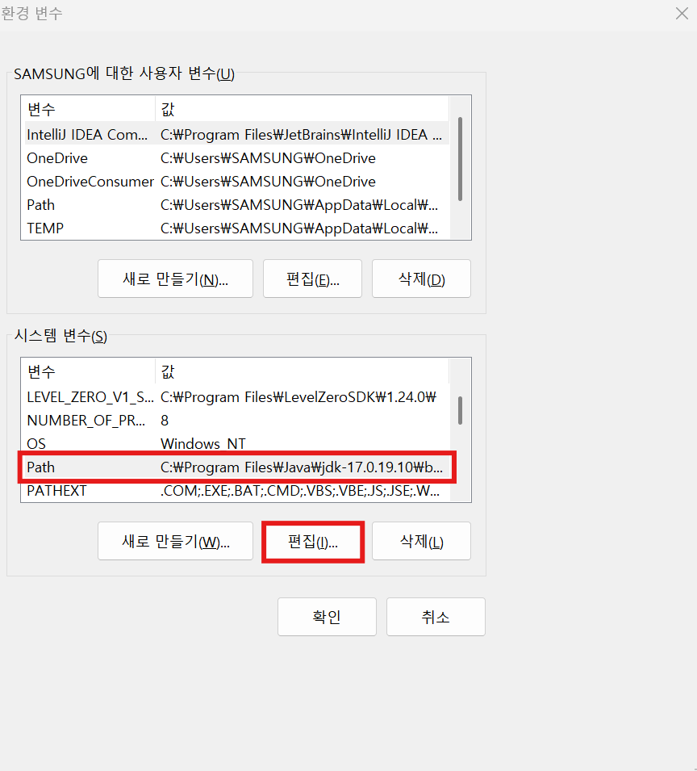

- 새로 만들기 → `%JAVA_HOME%\bin` 입력 → 확인

  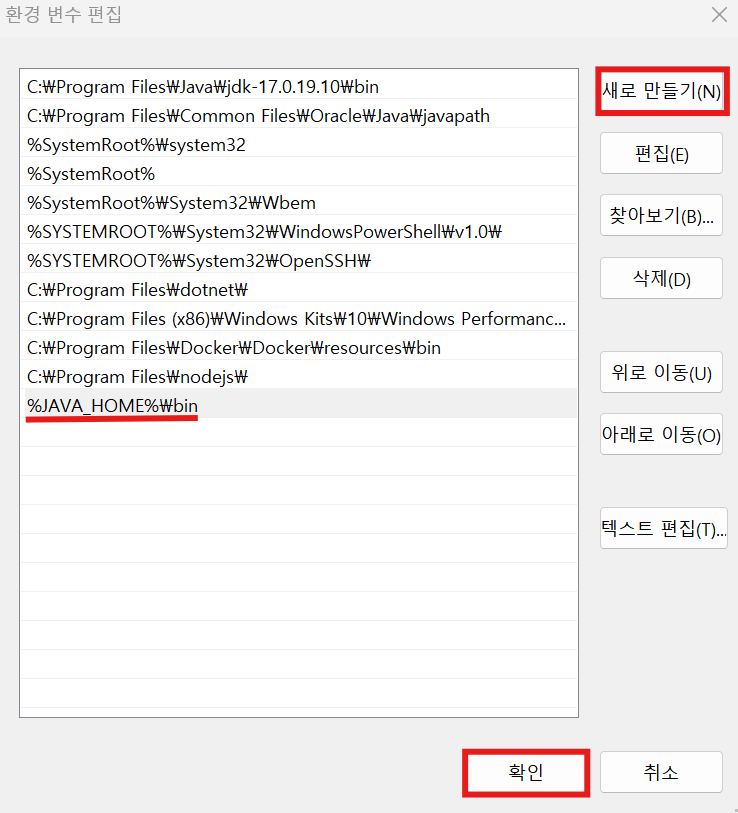

  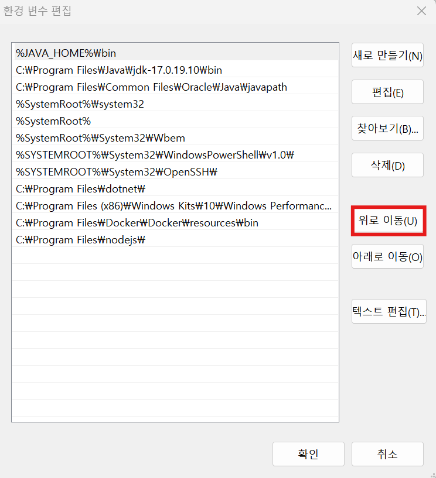

### 환경 변수 설정 확인

  ```powershell
  PS C:\Users\SAMSUNG> java -version
  
  >> openjdk version "17.0.19" 2026-04-21
  >> OpenJDK Runtime Environment Temurin-17.0.19+10 (build 17.0.19+10)
  >> OpenJDK 64-Bit Server VM Temurin-17.0.19+10 (build 17.0.19+10, mixed mode, sharing)
  ```